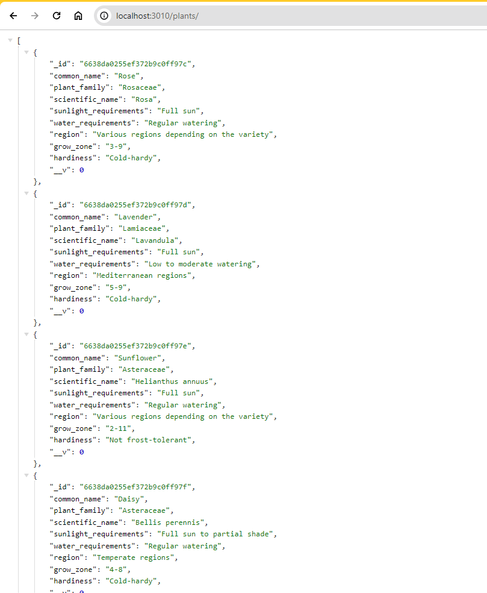

# SBA319
Skill based assessment for MongoDB Database Application

## Table of Contents

- [About](#about)
- [Technologies](#technologies)
- [Screenshots](#screenshots)
- [API routes](#API-routes)
- [API examples](#API-examples)
- [Run Locally](#run-locally)

## About

Tha website is the task from Perscolas Software Engineering Bootcamp.
<br>
<br>Create a server application with Node, Express, and MongoDB.
<br>Create a CRUD API using Express and MongoDB.
<br>Create MongoDB indexes.
<br>Use MongoDB indexing to make efficient queries.
<br>Create MongoDB validation rules.
<br>Use MongoDB validation to ensure data consistency. 


<br>The server is a simple info app, where client can figure out info about different garden plants.


The requirements listed here are absolute minimums. Ensures that the application meets these requirements before attempting to further expand any features.

1. **Use at least three different data collections within the database (such as users, posts, or comments).**
   - [x] Completed: Implemented collections for users, pets, and reviews.

2. **Utilize reasonable data modeling practices.**
   - [x] Completed: Implemented data modeling using Mongoose schemas.

3. **Create GET routes for all data that should be exposed to the client, using appropriate query commands to retrieve the data from the database.**
   - [x] Completed: Implemented GET routes for users, pets, and reviews.

4. **Create POST routes for data, as appropriate, using appropriate insertion commands to add data to the database.**
   - [x] Completed: Implemented POST routes for creating users, pets, and reviews.

5. **Create PATCH or PUT routes for data, as appropriate, using appropriate update commands to change data in the database.**
   - [x] Completed: Implemented PATCH routes for updating users and pets.

6. **Create DELETE routes for data, as appropriate, using appropriate delete commands to remove data from the database.**
   - [x] Completed: Implemented DELETE routes for deleting users, pets, and reviews.

7. **Include sensible indexes for any and all fields that are queried frequently.**
   - [x] Completed: Included indexes for reviews.ratings and user.email. Also in process the use of indexes for services

8. **Include sensible MongoDB data validation rules for at least one data collection.**
   - [x] Completed: Implemented MongoDB data validation rules for user and pet collections. Used validation for user.phone and user.email

9. **Populate your application's collections with sample data illustrating the use case of the collections.**
   - [x] Completed: Implemented seeding of data for users, pets, and reviews collections through function seedData in seedFunction.js.

10. **Utilize reasonable code organization practices.**
    - [x] Completed: Organized code into separate files and directories for models, routes, and controllers.

11. **Ensure that the program runs without errors.**
    - [x] Completed: Ensured the program runs without errors, handling exceptions where necessary.

12. **Commit frequently to the git repository.**
    - [x] Completed: Made frequent commits to the Git repository.

13. **Include a README file that contains a description of your application.**
    - [x] Completed: This README file describes the application and its features.

14. **Level of effort displayed in creativity and user experience.**
    - [x] Completed: Displayed creativity and effort in designing the application's functionality.

15. **Bonus Objective.**
The objectives listed here are not required but can make up for lost points if the requirements above are fulfilled.
**Use Mongoose to implement your application.**
  - [x] Completed: Utilized Mongoose for implementing the application.

## Technologies

- MongoDB
- Mongoose
- JavaScript
- Nodes JS
- Express JS

## Screenshots

1. Database
   <br>
   ## Requirements

## API Routes
  - **GET** /api/plants/
  - **GET** /api/plants/:id
  - **POST** /api/plants/
  - **PATCH** /api/plants/:id
  - **DELETE** /api/plants/:id
 
## API examples

`Plants`

1. Get all data

```javascript
GET  api/plants
```

2. Create plant data

```javascript
POST  api/plants
```

```JSON
  {
    "common_name": "Bell Pepper",
    "plant_family": "Solanaceae",
    "scientific_name": "Capsicum annuum",
    "sunlight_requirements": "Full sun",
    "water_requirements": "Regular watering",
    "region": "Various regions depending on the variety",
    "grow_zone": "1-11",
    "hardiness": "Cold-sensitive"
  },
```

3. Get single plant by id

```javascript
GET  api/plants/:id
```

4.  Update/Delete plant data

```javascript

UPDATE api/plants/:id
```

or

```javascript
DELETE  api/posts/:id
```

## Run Locally

To use the code from this repository, follow these steps:

1. **Clone the Repository:**

2. **Install Dependencies:**

3. **Set Up Environment Variables:**
- Create a `.env` file in the root directory.
- Define the following environment variables:
  ```
  MONGODB_URI=<your_mongodb_connection_string>
  ```

4. **Run the Application:**
 In browser `http://localhost:3010`
   - or `http://localhost:3010/plants`